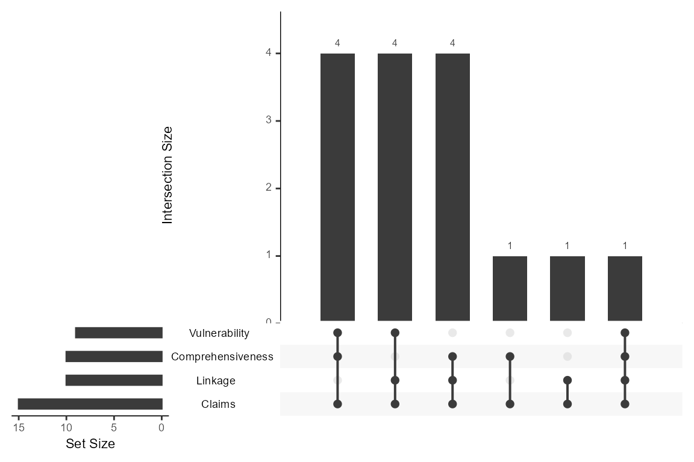
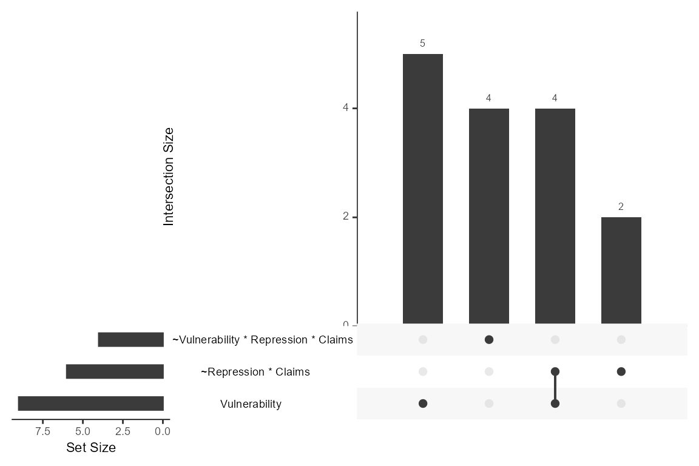

# Aggregation over partitions

``` r

library(QCAcluster)
```

The functions [`upset_conditions()`](../reference/upset_conditions.md)
and `upset_conjunctions()` can be used after one has derived
partition-specific models with
[`partition_min()`](../reference/partition_min.md) or
[`partition_min_inter()`](../reference/partition_min_inter.md). The
functions take the models from the `solution` column of the dataframes
produced with [`partition_min()`](../reference/partition_min.md)/or
[`partition_min_inter()`](../reference/partition_min_inter.md) as input
to produce an UpSet plot.
[`upset_conditions()`](../reference/upset_conditions.md) and
[`upset_configurations()`](../reference/upset_configurations.md) are
functions that draw on the `upset()` function of the
[UpSetR](https://CRAN.R-project.org/package=UpSetR/) package. We use the
dataset by [Grauvogel and von Soest
(2014)](https://doi.org/10.1017/S1755773910000251) for illustrating the
meaning and interpretation of UpSet plots.

### Aggregation over individual conditions

The following plot aggregates the occurrence and co-occurrence of single
conditions over the partition-specific parsimonious solutions.

``` r

data("Grauvogel2014")
# parsimonious solution for each type of Sender
GS_pars <- partition_min(
 dataset = Grauvogel2014,
 units = "Sender",
 cond = c("Comprehensiveness", "Linkage", "Vulnerability",
          "Repression", "Claims"),
 out = "Persistence",
 n_cut = 1, incl_cut = 0.75,
 solution = "P",
 BE_cons = rep(0.75, 3),
 BE_ncut = rep(1, 3))
# UpSet plot with three sets
upset_conditions(GS_pars, nsets = 4)
#> Warning: `aes_string()` was deprecated in ggplot2 3.0.0.
#> ℹ Please use tidy evaluation idioms with `aes()`.
#> ℹ See also `vignette("ggplot2-in-packages")` for more information.
#> ℹ The deprecated feature was likely used in the UpSetR package.
#>   Please report the issue to the authors.
#> This warning is displayed once per session.
#> Call `lifecycle::last_lifecycle_warnings()` to see where this warning was
#> generated.
#> Warning: Using `size` aesthetic for lines was deprecated in ggplot2 3.4.0.
#> ℹ Please use `linewidth` instead.
#> ℹ The deprecated feature was likely used in the UpSetR package.
#>   Please report the issue to the authors.
#> This warning is displayed once per session.
#> Call `lifecycle::last_lifecycle_warnings()` to see where this warning was
#> generated.
#> Warning: The `size` argument of `element_line()` is deprecated as of ggplot2 3.4.0.
#> ℹ Please use the `linewidth` argument instead.
#> ℹ The deprecated feature was likely used in the UpSetR package.
#>   Please report the issue to the authors.
#> This warning is displayed once per session.
#> Call `lifecycle::last_lifecycle_warnings()` to see where this warning was
#> generated.
```



Each line (or horizontal bar) in an UpSet plot displays how often a
single condition occurs over all 16 partition-specific models. The plot
shows that `Claims` occurs as a single condition in 15 models out of 16.

Each column or vertical bar in the plot shows how often single
conditions occur together in a model. (This means two conditions that
co-occur in a model are not necessarily part of the same conjunction.)
The plot shows that three different sets of conditions occur together in
five models each and that three more combinations of conditions are
specific to one model each.

### Aggregation over individual sufficient terms

The function
[`upset_configurations()`](../reference/upset_configurations.md)
decomposes models into the constitutive sufficient terms. A ‘term’ can
be a configuration (aka as conjunction) of conditions or single
sufficient conditions. Nonetheless, we called this function
[`upset_configurations()`](../reference/upset_configurations.md) for
convenience and to distinguish it from the
[`upset_conditions()`](../reference/upset_conditions.md) function.

``` r

upset_configurations(GS_pars, nsets = 3)
```



Over one pooled model and 15 within-models (there is extensive model
ambiguity), the individually sufficient condition `Vulnerability` is
part of eight models and is the only sufficient term in five models. In
three additional models, it coincides with the conjunction
`~Repression * Claims`. In total, `~Repression * Claims` occurs six
times in the 16 models.
